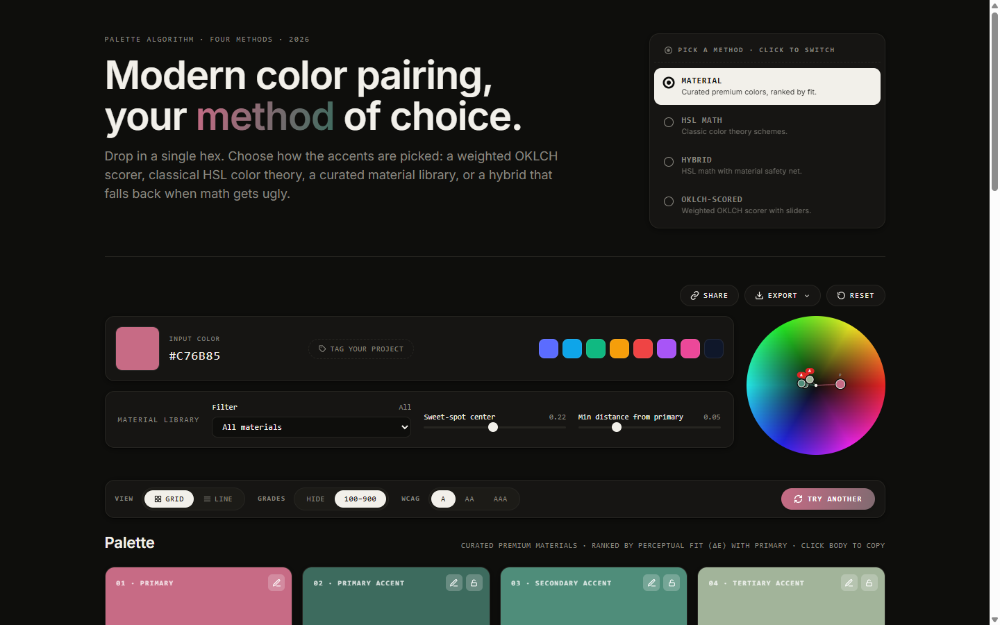
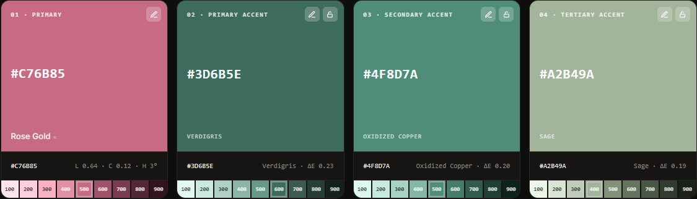
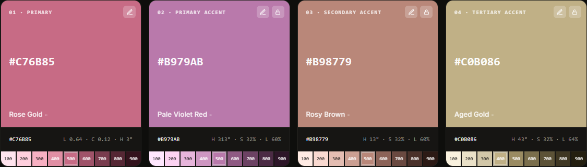
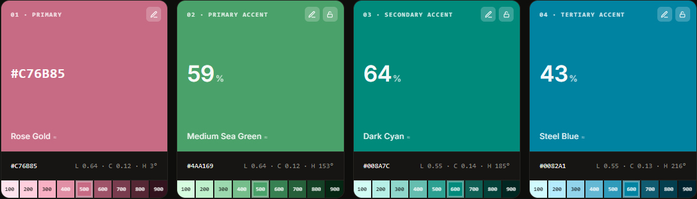
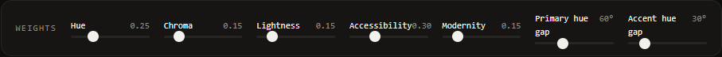
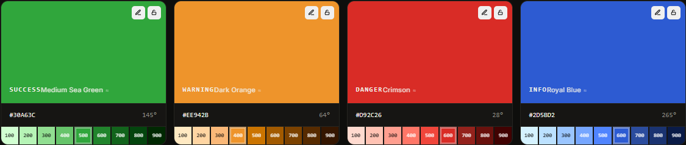
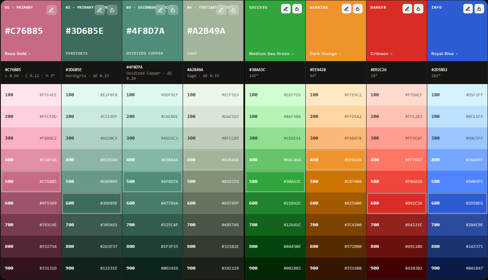
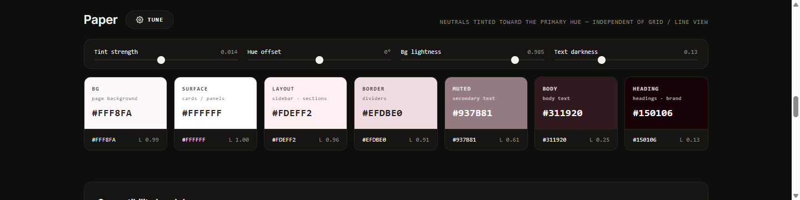
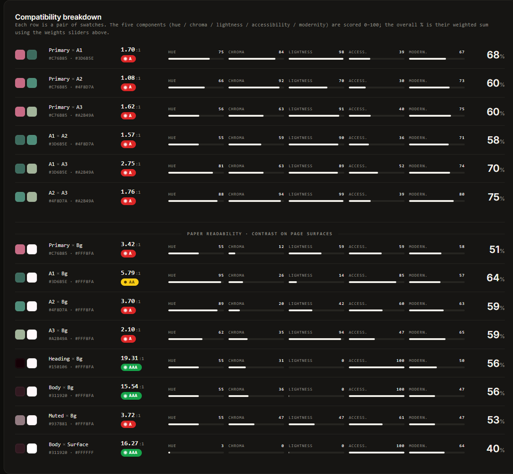
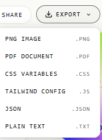

# Modern color pairing, your method of choice.

**Drop in a single hex. Get a coherent, accessible, production-ready palette in seconds.**

> Built by **[Hicham Zinalabdin](https://github.com/hichamza)** · [makethemaker.com](https://www.makethemaker.com)

One color in → primary + three accents + status colors + a neutral "paper" system + a full 100–900 grade ramp per color — all auditable against WCAG, all exportable, all in a single HTML file with zero dependencies.

No signup. No build step. No backend. Just open it and design.



---

## Pick how the math works

The whole point of this tool is that you don't have to commit to one theory of color. Four generators are built in — switch between them with one click and watch the palette redraw. Same input hex, four different ways to derive the accents.

### MATERIAL — curated premium colors, ranked by fit
A hand-picked library of named materials (Rose Gold, Verdigris, Oxidized Copper, Sage, Forest, Smoke, Ivory, Crimson…) gets ranked against your primary by perceptual distance (ΔE). You get accents that look *designed*, not generated. Each swatch shows its material name and ΔE distance from primary.



*Best when you want something that feels intentional and editorial out of the gate.*

### HSL MATH — classic color theory schemes
Pure, predictable HSL relationships — complementary, triadic, analogous, split-complementary. The textbook answer. Each swatch shows the H/S/L coordinates that produced it, plus the nearest material name for reference.



*Best when you want a result you can defend to a color theory purist, or when you're teaching/learning the fundamentals.*

### HYBRID — HSL math with a material safety net
Starts from HSL theory, then snaps each candidate to the nearest curated material if the math result lands somewhere ugly. You get the structure of theory with the polish of curation. When the HSL math is already clean, Hybrid looks identical to HSL — the safety net only kicks in when it has to.

*Best when you want theory-driven results without the occasional muddy outcome.*

### OKLCH-SCORED — weighted OKLCH scorer with sliders
The power-user mode. Candidates are evaluated in perceptually uniform OKLCH space across five axes — hue relationship, chroma harmony, lightness contrast, accessibility, and modernity — each with its own weight slider. Swatches show the **overall compatibility score (%)** instead of a static hex, so you can see exactly how well each accent fits.



The weight panel is what makes this method tunable:



*Best when you know what you want and need fine-grained control over how the algorithm decides.*

> **Switch methods anytime.** The input hex stays put; only the accents and ranking logic change. Compare side-by-side in seconds.

---

## What you get from one hex

### Status colors that match the palette
Four status colors — Success, Warning, Danger, Info — adaptively shifted toward your primary hue so they don't feel bolted on. Lock and edit any of them independently.



### A grade system that ships
Toggle a Tailwind-style **100–900 ramp** under every color (palette *and* status). Every step is a real hex, ready to paste into your design tokens. The Line view lays out every color and every grade in a single dense table.



### A "Paper" neutral system
Seven surface-tier neutrals — BG, Surface, Layout, Border, Muted, Body, Heading — all subtly tinted toward your primary hue so the whole UI reads as one system instead of "color + grey." Open the Tune panel for four sliders: **Tint strength**, **Hue offset**, **Bg lightness**, **Text darkness**.



### A compatibility audit, not just a swatch grid
Every pair of colors is scored 0–100 across **Hue / Chroma / Lightness / Accessibility / Modernity**, with a weighted overall %. A separate **paper-readability** section shows every accent's contrast ratio against the page surfaces — Bg, Surface, etc. — with WCAG badges (A / AA / AAA) inline. You see exactly where a pairing breaks down and why.



### Accessibility, enforced
Set the minimum to **A, AA, or AAA**. The generator filters its candidate pool so picked accents and statuses clear the threshold against your primary. Anything that physically can't reach the bar gets a red `!` so you know it's not just a bug.

### Export to whatever your stack speaks
One click on **Export** gives you six formats — covering everything from a poster on Slack to a drop-in `tailwind.config.js`:




| Format | File | What you get |
|---|---|---|
| **PNG Image** | `.png` | Hi-DPI rendering of the full palette (palette + status + grades + paper), Canvas-rendered at 2× — paste it into a deck or design doc. |
| **PDF Document** | `.pdf` | Same hi-DPI render packaged as a print-ready PDF via jsPDF (CDN). |
| **CSS Variables** | `.css` | A `:root { --primary: #…; --primary-100: #…; … }` block for palette, status, grades, and paper neutrals. Paste into any stylesheet. |
| **Tailwind Config** | `.js` | A ready `module.exports = { theme: { extend: { colors: { … } } } }` — every swatch and grade keyed by name. |
| **JSON** | `.json` | Full structured dump (palette, status, grades, paper, weights, tags, timestamp). For tooling, design tokens pipelines, or your own scripts. |
| **Plain Text** | `.txt` | Human-readable hex list — fastest way to hand off to a non-technical teammate. |

Everything is generated client-side; no upload, no account, no server round-trip.

---

## Feature list

- **Four palette algorithms** — Material, HSL Math, Hybrid, OKLCH-Scored
- **Project tags** — pick topic + feel (corporate, playful, vintage, editorial…) and the candidate pool retunes
- **Locks** — pin any swatch; "Try another" leaves it alone and keeps its name stable
- **Grid or Line view** — cards for browsing, continuous rows for comparing
- **100–900 grade ramps** — toggle per palette or per swatch
- **Paper neutrals** — seven surface tiers, tunable with four sliders
- **WCAG A / AA / AAA** filter with inline contrast badges
- **Compatibility breakdown** — every pair scored on 5 axes plus overall %
- **Material library filter** — narrow the curated pool, control sweet-spot and minimum-distance from primary
- **Color wheel preview** — see your palette's geometry at a glance
- **Export** — PNG, PDF, CSS variables, Tailwind config, JSON, plain text
- **Share links** — every interaction encodes into the URL hash
- **View prefs persist** — grid/line, grades, WCAG min remembered in `localStorage`
- **Single file, ~250 KB** — no fonts, no third-party scripts, no tracking

---

## Try it

Open [`index.html`](index.html) in any modern browser. That's the whole app.

```bash
# Local preview
python3 -m http.server 8080
# then visit http://localhost:8080
```

### Hosting on GitHub Pages
1. Create a new repository and drop these files in.
2. Settings → Pages → source = `main` branch, root folder.
3. Live at `https://<username>.github.io/<repo>/` within a minute.

Also works as-is on Netlify, Vercel, Cloudflare Pages, S3, or any static host.

---

## Under the hood

- **OKLCH color math** computed directly from sRGB hex — no external color libraries.
- **WCAG 2.1** relative-luminance contrast for every accessibility check.
- **State encoding** in the URL hash, so any palette is a shareable link.
- **No analytics, no telemetry, no network calls.** The file you open is the file you use.

---

## License

[CC BY 4.0](LICENSE) — use it, fork it, ship it, even commercially. The one thing we ask: **credit Hicham Zinalabdin** (a visible mention + link back to this repo is plenty) and indicate if you made changes. Just don't blame us if your designer disagrees with the algorithm.

---

Made by **[Hicham Zinalabdin](https://github.com/hichamza)** at [makethemaker.com](https://www.makethemaker.com).
